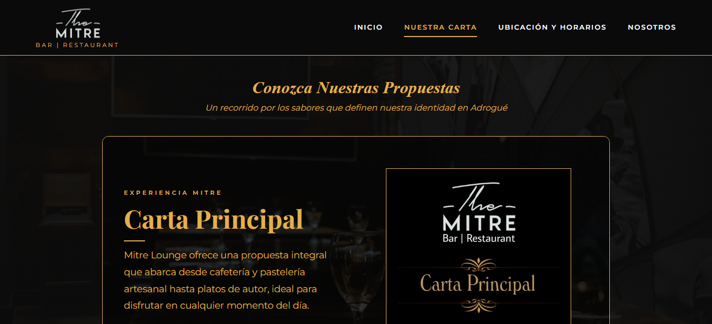
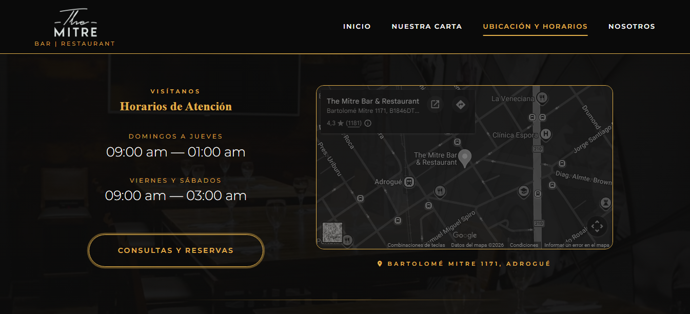
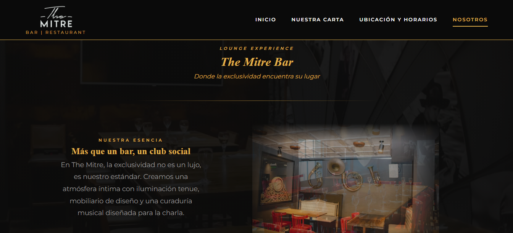
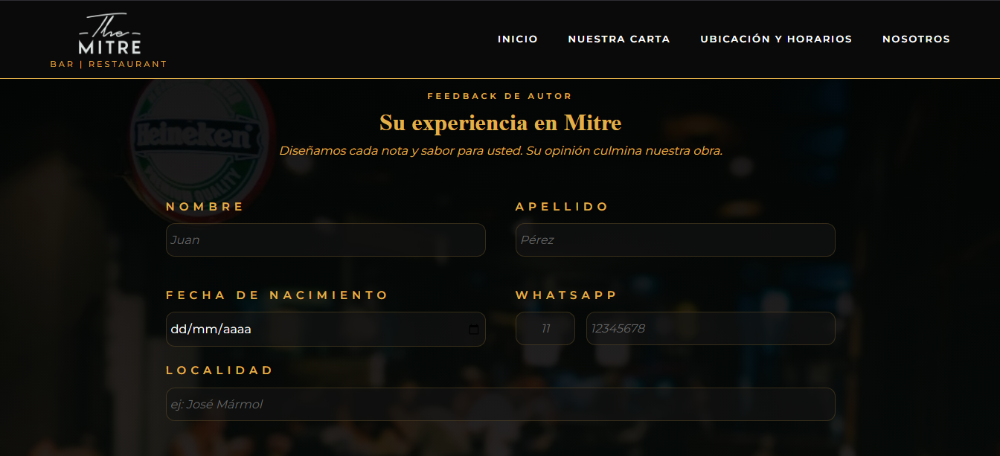
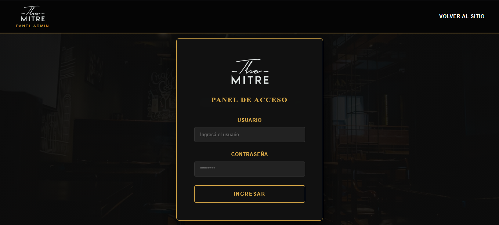
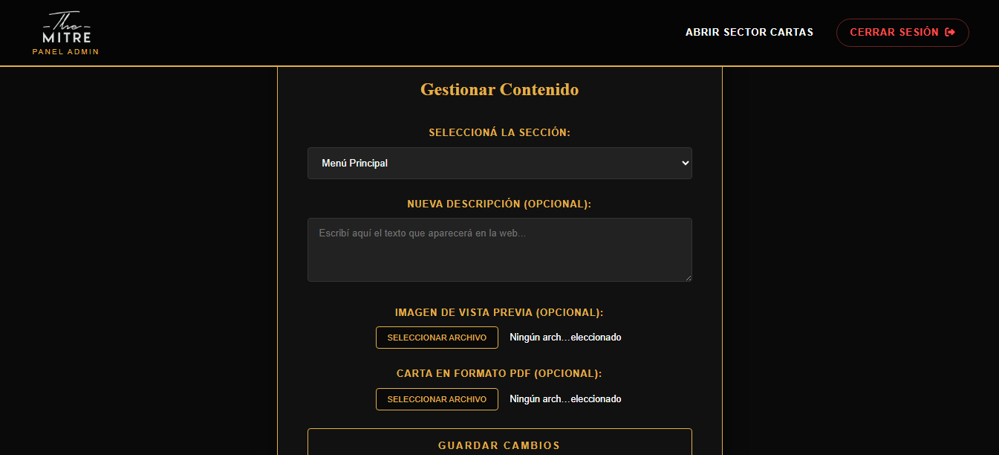

# The Mitre Bar

Una aplicación web desarrollada para **The Mitre Bar**, diseñada para realizar una encuesta de satisfacción, gestionar y mostrar la oferta gastronómica y de coctelería del establecimiento de manera dinámica y moderna.

## Tecnologías Utilizadas
El proyecto utiliza un stack basado en JavaScript para cubrir tanto el frontend como el backend:

* **Backend:** [Node.js](https://nodejs.org/) con el framework [Express.js](https://expressjs.com/).
* **Motor de Plantillas:** [EJS](https://ejs.co/) (Embedded JavaScript) para la renderización de vistas dinámicas.
* **Frontend:** HTML5, CSS3 y JavaScript (Vanilla) para la interactividad.
* **Gestión de Datos:** Manejo de archivos JSON y controladores específicos para la lógica de negocio.

## Librerias
* **Alertas:** [SweetAlert2](https://sweetalert2.github.io/) para la visualización de alertas en errores de formulario.
* **Animación en Carrusel:** [Swiper]((https://sweetalert2.github.io/)) para animación y transición automática en carrusel de imágenes y videos de la página "nosotros".

## Vista Previa y Páginas

A continuación se detallan las secciones principales de la aplicación. Podes insertar tus capturas reemplazando el texto entre paréntesis:

### Bienvenida
Página de aterrizaje con la identidad visual de **The Mitre Bar**, promociones y destacados.
> 

### Nuestra Carta
Sección dinámica que lista los productos consumiendo la descripción breve desde /data/textos.json, la imagen previa de /preview_cartas y el archivo de las distintas cartas desde la carpeta /cartas_pdf.
> 

### Ubicación y Horarios
Interfaz para que el usuario gestione sus productos, cantidades y vea el total de su pedido.
> 

### Nosotros
Sección dinámica que detalla brevemente al bar, los servicios que ofrece, y el menú general.
> 

### Encuesta
Sección dinámica que realiza una encuesta al usuario para luego enviar los datos ya validados a una hoja de cálculo de google sheets.
> 

### Login
Sistema de autenticación para usuarios registrados.
> 

### 🛠️ Panel de Administración
Vista para la gestión de cartas: permite qctualizar individualmente la descripción, la imagen previa y el archivo de cada carta.
> 

## 📁 Estructura del Proyecto

```text
themitrebar/
├── data/           # Archivo JSON (Descripciones de las cartas).
├── public/         # Archivos estáticos (CSS, Imágenes, JS Frontend).
├── server/         # Lógica del servidor.
│   ├── routes/     # Definición de rutas (endpoints).
│   └── app.js      # Configuración de Express y entrada principal.
├── views/          # Plantillas EJS.
├── package.json    # Dependencias y scripts.
└── .gitignore      # Archivos excluidos de Git.
